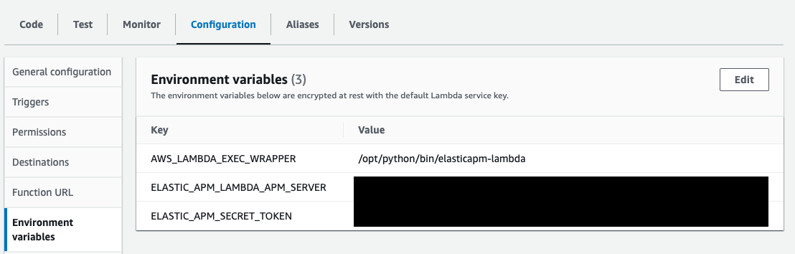

---
mapped_pages:
  - https://www.elastic.co/guide/en/apm/agent/python/current/lambda-support.html
applies_to:
  stack:
  serverless:
    observability:
  product:
    apm_agent_python: ga
sub:
  apm-lambda-ext-v: ver-1-6-0
  apm-python-v: ver-6-24-0
---

# Monitoring AWS Lambda Python Functions [lambda-support]

The Python APM Agent can be used with AWS Lambda to monitor the execution of your AWS Lambda functions.

:::{note}
The Centralized Agent Configuration on the Elasticsearch APM currently does NOT support AWS Lambda.
:::


## Prerequisites [_prerequisites]

You need an APM Server to send APM data to. Follow the [APM Quick start](docs-content://solutions/observability/apm/get-started-fleet-managed-apm-server.md) if you have not set one up yet. For the best-possible performance, we recommend setting up APM on {{ecloud}} in the same AWS region as your AWS Lambda functions.

## Step 1: Add the APM Layers to your Lambda function [add_the_apm_layers_to_your_lambda_function]

Both the [{{apm-lambda-ext}}](apm-aws-lambda://reference/index.md) and the Python APM Agent are added to your Lambda function as [AWS Lambda Layers](https://docs.aws.amazon.com/lambda/latest/dg/invocation-layers.html). Therefore, you need to add the corresponding Layer ARNs (identifiers) to your Lambda function.

:::::::{tab-set}

::::::{tab-item} AWS Web Console
To add the layers to your Lambda function through the AWS Management Console:

1. Navigate to your function in the AWS Management Console
2. Scroll to the Layers section and click the *Add a layer* button 
3. Choose the *Specify an ARN* radio button
4. Copy and paste the following ARNs of the {{apm-lambda-ext}} layer and the APM agent layer in the *Specify an ARN* text input:
    * APM Extension layer:
      ```
      arn:aws:lambda:{AWS_REGION}:267093732750:layer:elastic-apm-extension-{{apm-lambda-ext-v}}-{ARCHITECTURE}:1 <1>
      ```
      1. Replace `{AWS_REGION}` with the AWS region of your Lambda function and `{ARCHITECTURE}` with its architecture.

    * APM agent layer:
      ```
      arn:aws:lambda:{AWS_REGION}:267093732750:layer:elastic-apm-python-{{apm-python-v}}:{LAYER_VERSION} <1>
      ```
      1. Replace `{AWS_REGION}` with the AWS region of your Lambda function. While the version of the layer `{LAYER_VERSION}`is
         usually `1`, refer to the ARNs listed in [Github releases](https://github.com/elastic/apm-agent-python/releases) to get
         the exact one.

    
5. Click the *Add* button
::::::

::::::{tab-item} AWS CLI
To add the Layer ARNs of the {{apm-lambda-ext}} and the APM agent through the AWS command line interface execute the following command:

```bash
aws lambda update-function-configuration --function-name yourLambdaFunctionName \
--layers arn:aws:lambda:{AWS_REGION}:267093732750:layer:elastic-apm-extension-{{apm-lambda-ext-v}}-{ARCHITECTURE}:1 \ <1>
arn:aws:lambda:{AWS_REGION}:267093732750:layer:elastic-apm-python-{{apm-python-v}}:{LAYER_VERSION} <2>
```
1. Replace `{AWS_REGION}` with the AWS region of your Lambda function and `{ARCHITECTURE}` with its architecture.
2. Replace `{AWS_REGION}` with the AWS region of your Lambda function. While the version of the layer `{LAYER_VERSION}`is
   usually `1`, refer to the ARNs listed in [Github releases](https://github.com/elastic/apm-agent-python/releases) to get
   the exact one.
::::::

::::::{tab-item} SAM
In your SAM `template.yml` file add the Layer ARNs of the {{apm-lambda-ext}} and the APM agent as follows:

```yaml
...
Resources:
  yourLambdaFunction:
    Type: AWS::Serverless::Function
    Properties:
      ...
      Layers:
          - arn:aws:lambda:{AWS_REGION}:267093732750:layer:elastic-apm-extension-{{apm-lambda-ext-v}}-{ARCHITECTURE}:1 <1>
          - arn:aws:lambda:{AWS_REGION}:267093732750:layer:elastic-apm-python-{{apm-python-v}}:{LAYER_VERSION} <2>
...
```
1. Replace `{AWS_REGION}` with the AWS region of your Lambda function and `{ARCHITECTURE}` with its architecture.
2. Replace `{AWS_REGION}` with the AWS region of your Lambda function. While the version of the layer `{LAYER_VERSION}`is
   usually `1`, refer to the ARNs listed in [Github releases](https://github.com/elastic/apm-agent-python/releases) to get
   the exact one.
::::::

::::::{tab-item} Serverless
In your `serverless.yml` file add the Layer ARNs of the {{apm-lambda-ext}} and the APM agent to your function as follows:

```yaml
...
functions:
  yourLambdaFunction:
    handler: ...
    layers:
      - arn:aws:lambda:{AWS_REGION}:267093732750:layer:elastic-apm-extension-{{apm-lambda-ext-v}}-{ARCHITECTURE}:1 <1>
      - arn:aws:lambda:{AWS_REGION}:267093732750:layer:elastic-apm-python-{{apm-python-v}}:{LAYER_VERSION} <2>
...
```
1. Replace `{AWS_REGION}` with the AWS region of your Lambda function and `{ARCHITECTURE}` with its architecture.
2. Replace `{AWS_REGION}` with the AWS region of your Lambda function. While the version of the layer `{LAYER_VERSION}`is
   usually `1`, refer to the ARNs listed in [Github releases](https://github.com/elastic/apm-agent-python/releases) to get
   the exact one.
::::::

::::::{tab-item} Terraform
To add the{{apm-lambda-ext}} and the APM agent to your function add the ARNs to the `layers` property in your Terraform file:

```yaml
...
resource "aws_lambda_function" "your_lambda_function" {
  ...
  layers = ["arn:aws:lambda:{AWS_REGION}:267093732750:layer:elastic-apm-extension-{{apm-lambda-ext-v}}-{ARCHITECTURE}:1", "arn:aws:lambda:{AWS_REGION}:267093732750:layer:elastic-apm-python-{{apm-python-v}}:{LAYER_VERSION}"] <1>
}
...
```
1. Replace `{AWS_REGION}` with the AWS region of your Lambda function. While the version of the layer `{LAYER_VERSION}`is
   usually `1`, refer to the ARNs listed in [Github releases](https://github.com/elastic/apm-agent-python/releases) to get
   the exact one.
::::::

::::::{tab-item} Container Image
To add the {{apm-lambda-ext}} and the APM agent to your container-based function extend the Dockerfile of your function image as follows:

```Dockerfile
FROM docker.elastic.co/observability/apm-lambda-extension-{IMAGE_ARCH}:latest AS lambda-extension <1>
FROM docker.elastic.co/observability/apm-agent-python:latest AS python-agent

# FROM ...  <-- this is the base image of your Lambda function

COPY --from=lambda-extension /opt/elastic-apm-extension /opt/extensions/elastic-apm-extension
COPY --from=python-agent /opt/python/ /opt/python/

# ...
```
1. Replace `{IMAGE_ARCH}` with the architecture of the image.
::::::

:::::::

## Step 2: Configure APM on AWS Lambda [configure_apm_on_aws_lambda]

The {{apm-lambda-ext}} and the APM Python agent are configured through environment variables on the AWS Lambda function.

For the minimal configuration, you will need the *APM Server URL* to set the destination for APM data and an [APM Secret Token](docs-content://solutions/observability/apm/secret-token.md). If you prefer to use an [APM API key](docs-content://solutions/observability/apm/api-keys.md) instead of the APM secret token, use the `ELASTIC_APM_API_KEY` environment variable instead of `ELASTIC_APM_SECRET_TOKEN` in the following configuration.

For production environments, we recommend [using the AWS Secrets Manager to store your APM authentication key](apm-aws-lambda://reference/aws-lambda-secrets-manager.md) instead of providing the secret value as plaintext in the environment variables.

:::::::{tab-set}

::::::{tab-item} AWS Web Console
To configure APM through the AWS Management Console:

1. Navigate to your function in the AWS Management Console
2. Click on the *Configuration* tab
3. Click on *Environment variables*
4. Add the following required variables:

```bash
AWS_LAMBDA_EXEC_WRAPPER       = /opt/python/bin/elasticapm-lambda  <1>
ELASTIC_APM_LAMBDA_APM_SERVER = <YOUR-APM-SERVER-URL>              <2>
ELASTIC_APM_SECRET_TOKEN      = <YOUR-APM-SECRET-TOKEN>            <3>
ELASTIC_APM_SEND_STRATEGY     = background                         <4>
```

1. Use this exact fixed value.
2. This is your APM Server URL.
3. This is your APM secret token.
4. The [ELASTIC_APM_SEND_STRATEGY](apm-aws-lambda://reference/aws-lambda-config-options.md#_elastic_apm_send_strategy) defines when APM data is sent to your Elastic APM backend. To reduce the execution time of your lambda functions, we recommend to use the background strategy in production environments with steady load scenarios.


::::::

::::::{tab-item} AWS CLI
To configure APM through the AWS command line interface execute the following command:

```bash
aws lambda update-function-configuration --function-name yourLambdaFunctionName \
    --environment "Variables={AWS_LAMBDA_EXEC_WRAPPER=/opt/python/bin/elasticapm-lambda,ELASTIC_APM_LAMBDA_APM_SERVER=<YOUR-APM-SERVER-URL>,ELASTIC_APM_SECRET_TOKEN=<YOUR-APM-SECRET-TOKEN>,ELASTIC_APM_SEND_STRATEGY=background}" <1>
```
1. The [ELASTIC_APM_SEND_STRATEGY](apm-aws-lambda://reference/aws-lambda-config-options.md#_elastic_apm_send_strategy) defines when APM data is sent to your Elastic APM backend. To reduce the execution time of your lambda functions, we recommend to use the background strategy in production environments with steady load scenarios.
::::::

::::::{tab-item} SAM
In your SAM `template.yml` file configure the following environment variables:

```yaml
...
Resources:
  yourLambdaFunction:
    Type: AWS::Serverless::Function
    Properties:
      ...
      Environment:
          Variables:
            AWS_LAMBDA_EXEC_WRAPPER: /opt/python/bin/elasticapm-lambda
            ELASTIC_APM_LAMBDA_APM_SERVER: <YOUR-APM-SERVER-URL>
            ELASTIC_APM_SECRET_TOKEN: <YOUR-APM-SECRET-TOKEN>
            ELASTIC_APM_SEND_STRATEGY: background <1>
...
```

1. The [ELASTIC_APM_SEND_STRATEGY](apm-aws-lambda://reference/aws-lambda-config-options.md#_elastic_apm_send_strategy) defines when APM data is sent to your Elastic APM backend. To reduce the execution time of your lambda functions, we recommend to use the background strategy in production environments with steady load scenarios.

::::::

::::::{tab-item} Serverless
In your `serverless.yml` file configure the following environment variables:

```yaml
...
functions:
  yourLambdaFunction:
    ...
    environment:
      AWS_LAMBDA_EXEC_WRAPPER: /opt/python/bin/elasticapm-lambda
      ELASTIC_APM_LAMBDA_APM_SERVER: <YOUR-APM-SERVER-URL>
      ELASTIC_APM_SECRET_TOKEN: <YOUR-APM-SECRET-TOKEN>
      ELASTIC_APM_SEND_STRATEGY: background <1>
...
```

1. The [ELASTIC_APM_SEND_STRATEGY](apm-aws-lambda://reference/aws-lambda-config-options.md#_elastic_apm_send_strategy) defines when APM data is sent to your Elastic APM backend. To reduce the execution time of your lambda functions, we recommend to use the background strategy in production environments with steady load scenarios.

::::::

::::::{tab-item} Terraform
In your Terraform file configure the following environment variables:

```yaml
...
resource "aws_lambda_function" "your_lambda_function" {
  ...
  environment {
    variables = {
      AWS_LAMBDA_EXEC_WRAPPER       = /opt/python/bin/elasticapm-lambda
      ELASTIC_APM_LAMBDA_APM_SERVER = "<YOUR-APM-SERVER-URL>"
      ELASTIC_APM_SECRET_TOKEN      = "<YOUR-APM-SECRET-TOKEN>"
      ELASTIC_APM_SEND_STRATEGY     = "background" <1>
    }
  }
}
...
```

1. The [ELASTIC_APM_SEND_STRATEGY](apm-aws-lambda://reference/aws-lambda-config-options.md#_elastic_apm_send_strategy) defines when APM data is sent to your Elastic APM backend. To reduce the execution time of your lambda functions, we recommend to use the background strategy in production environments with steady load scenarios.

::::::

::::::{tab-item} Container Image
Environment variables configured for an AWS Lambda function are passed to the container running the lambda function. You can use one of the other options (through AWS Web Console, AWS CLI, etc.) to configure the following environment variables:

```bash
AWS_LAMBDA_EXEC_WRAPPER       = /opt/python/bin/elasticapm-lambda  <1>
ELASTIC_APM_LAMBDA_APM_SERVER = <YOUR-APM-SERVER-URL>              <2>
ELASTIC_APM_SECRET_TOKEN      = <YOUR-APM-SECRET-TOKEN>            <3>
ELASTIC_APM_SEND_STRATEGY     = background                         <4>
```

1. Use this exact fixed value.
2. This is your APM Server URL.
3. This is your APM secret token.
4. The [ELASTIC_APM_SEND_STRATEGY](apm-aws-lambda://reference/aws-lambda-config-options.md#_elastic_apm_send_strategy) defines when APM data is sent to your Elastic APM backend. To reduce the execution time of your lambda functions, we recommend to use the background strategy in production environments with steady load scenarios.

::::::

:::::::

You can optionally [fine-tune the Python agent](/reference/configuration.md) or the [configuration of the {{apm-lambda-ext}}](apm-aws-lambda://reference/aws-lambda-config-options.md).

That’s it. After following the steps above, you’re ready to go!  Your Lambda function invocations should be traced from now on.  Spans will be captured for [supported technologies](/reference/supported-technologies.md). You can also use [`capture_span`](/reference/api-reference.md#api-capture-span) to capture custom spans, and you can retrieve the `Client` object for capturing exceptions/messages using [`get_client`](/reference/api-reference.md#api-get-client).

